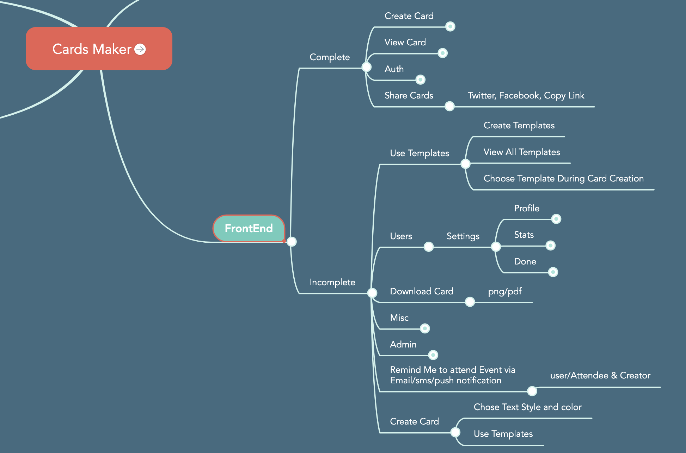
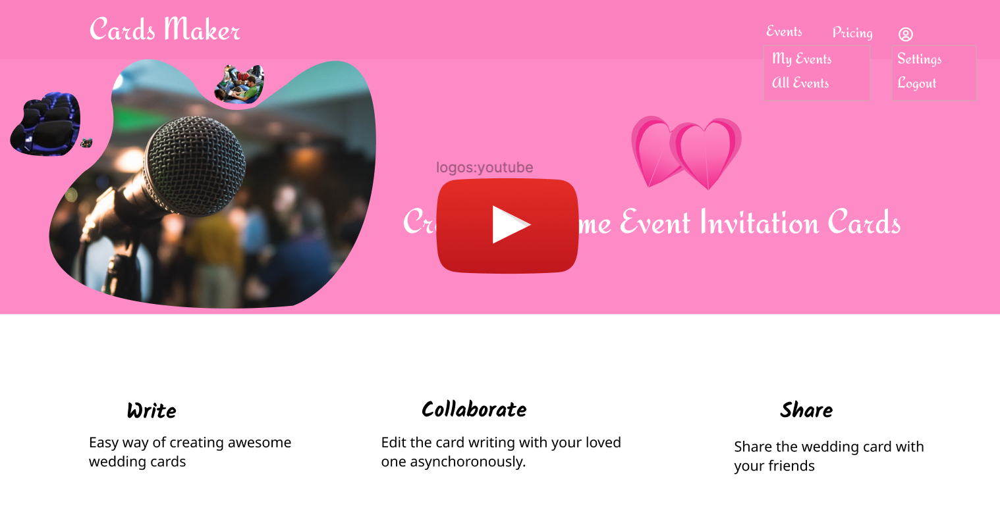

# Cards Maker

## 🌱 Idea Background

We were sitting down with my friends on a chilly Saturday waiting for a game.

> "Why don't we have a simple and easy app that the bride and groom can use to invite users without using the printed cards and paper", One of my friends suggested.

I thought for a second, that's an awesome idea.

> "But I believe there's an app for that man", I brushed off

> "Which one then?" He asked convincing

I even had no idea if there was such an app. I took out my phone and started googling. Yeah there were some solutions but not the way were thinking of.

> You IT guys should think of this stuff man, or what are you even doing." He murmured frustratingly

It was funny the way he said but it was true. On the next few weeks, I spent my free time researching on the relevant solutions. Even though we never had time to catch up and discuss on the idea, I started doing research, design and development.

## 🧰 Tools

- Node JS - API development
- React JS - Frontend library

**Why ReactJS?**

- Fast rendering on virtual DOM. This was important consideration as the solution was to use [What You See Is What You Get - WYSIWYG](https://en.wikipedia.org/wiki/WYSIWYG) technique.
- Previous experience working on React projects
- Scalability especially to transform to mobile app, I would use React Native.
- Community support.

## ⚙️ Other Development tools

- Redux - open-source JavaScript library for managing application state.
- Redux-saga - Easily make asynchronous calls things like data fetching
- Bulma - CSS framework based on flexbox and sass
- Parcel - Frontend React bundler
- Netlify - Hosting frontend React JS solution
- Heroku - Hosting Backend Node JS solution

## 👨🏽‍🏫 👨‍💻 Documentation
A simple tutorial of how I created an event card:

- [Project and folder structure Setup](./frontend/tutorials/projectSetup.md) - Getting started with React
- [Parcel Bundler Configuration](./frontend/tutorials/parcel.md)
- [User Flow](./frontend/tutorials/productAnalysis.md)
- [User Authentication](./frontend/tutorials/userAuthentication.md)
- [Creating event cards](./frontend/tutorials/cards/createCards.md)
- [View Cards publicly](./frontend/client/src/containers/Cards/cards.js)
- [Managing User cards and user details](./frontend/client/src/containers/Cards/home/index.js)
- [Search Event Cards](<(./frontend/client/src/containers/Cards/../../../../../client/src/components/cards/searchCard.js)>)
- [Share Event Cards in social media](./frontend/client/src/components/cards/shareButton.js)

## 📟 Source Code: How to Get Started

- You must have Node installed, at least version 14 onwards, Check out on https://nodejs.org/en/download/
- Clone [this Cards Maker](https://github.com/Nicanor008/cards-maker.git) repo and open the project folder on your favorite IDE or editor.
- Install dependencies, `yarn` on terminal.
- open the frontend and backend in different terminals
- Copy the `frontend/.env-example` file to `frontend/.env`
- On frontend terminal, run the development environment, `yarn client` or `yarn start`.
- Open your favorite browser, and run `http://localhost:1234`
- on backend terminal, run `yarn dev`

## 👨🏻‍🚀 Live Playground

[Frontend Demo](https://cards-maker.netlify.app/create)

## 📛 Why the name `Cards Maker`

No special reason. Just what came into my mind. The aim of the solution is the make cards just the same any user will create a printed event card. Hence **Cards Maker**

## ⛏️ Problem Statement

Where I grew up, Eldoret, Kenya, whenever there's an event, we print event cards and send one person to go to every individual and give them the card. Long-distance relatives can be called via phone or a letter must be sent. Anything can happen, letters get lost or rained on. (Eldoret is a highland place, so it's mostly rainy). Some people even forget they were invited to an event without a reminder.

## 🛣️ Roadmap
[Here](https://mm.tt/1476175414?t=P60NyMDd2G) is a list of complete and ongoing features and enhancements. Here is an overview.

## 🌀 Purpose

You can use Cards Makers to:

- Create and view Event Cards
- Invite users to read/edit the event
- Share Event cards on social media
- Download Event cards as image(png/jpg) or pdf
- Use a Template to create event cards

## 🎯 Target Audience

Generally any event invitation. This includes but not limited to:

- Pre-wedding & weddings
- Celebrations - birthdays, graduation, baby shower, job promotion etc
- Anniversaries

## 💫 Cards Maker Overview Video

## ✔️ License

[MIT license](./LICENSE)
