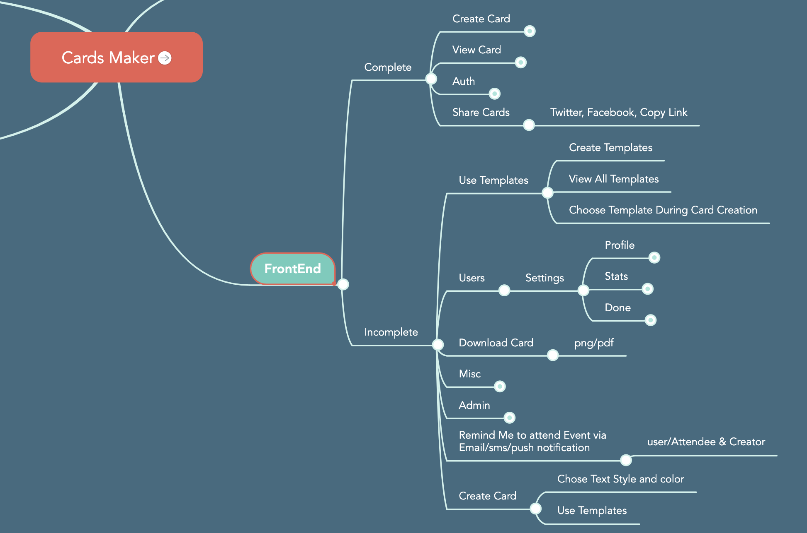

# Cards Maker Tutorial
## 🌱 Idea Background
We were sitting down with my friends on a chilly Saturday waiting for a game. 
> "Why don't we have a simple and easy app that the bride and groom can use to invite users without using the printed cards and paper", One of my friends suggested.

I thought for a second, that's an awesome idea. 
> "But I believe there's an app for that man", I brushed off

> "Which one then?" He asked convincing

I even had no idea if there was such an app. I took out my phone and started googling. Yeah there were some solutions but not the way were thinking of. 
> You IT guys should think of this stuff man, or what are you even doing.

It was funny the way he said but it was true. On the next few weeks, I spent my free time researching on the relevant solutions. Even though we never had time to catch up and discuss on the idea, I started doing the development of the API using NodeJS.

## Tools
- Node JS - API development
- React JS - Frontend library
> **Why NodeJS?** - I've been using NodeJS for a while on Restful API development. And since I was a sole developer then I had no option. Also, real time communication. [Cards Maker API documentation](https://cardsmaker.herokuapp.com/docs/)

After I had good grasp of how the API was and ready for use on frontend, I started the frontend development using React library.

**Why did I choose ReactJS?**
- Fast rendering. This was important consideration as the solution was to use WYSWYG technique.
- Previous experience working on React projects
- Scalability especially to transform to mobile app, I would use React Native.
- Community support.

## Other Development tools
- Redux - State management
- Redux-saga
- Bulma
- Parcel
- Netlify
- Heroku

## SourceCode: How to Get Started
- Clone this repo
- Open this project folder
- Install dependencies, `yarn` or `npm install`
- Copy the `.env-example` file to `.env`
- On terminal, run the development environment, `yarn client`
- Open your favorite browser, and run `http://localhost:1234`

## Live Playground
[Frontend](https://cards-maker.netlify.app/create)

## 📛 Why the name `Cards Maker`
No special reason. Just what came into my mind. The aim of the solution is the make cards just the same any user will create a printed event car. Hence **Cards Maker**

## ⛏️ Problem Statement
Where I've grown, Eldoret, Kenya, whenever there's is an event, we print event card and send one person to go to every individual and give them the card. The long distance relaties can be called via a phone or still a letter has to be sent. Anything can happen, letters get lost or rained on. (Eldoret is highland place, so it's rainy mostly).Some people even forget they were invited to an event because there was no reminder.

## 🛣️ Roadmap
I work on this solution part time, hence the slow releases.
[Here](https://mm.tt/1476175414?t=P60NyMDd2G) is a list of complete and ongoing features and enhancements. Here is an overview.

## 🌀 Purpose
You can use Cards Makers to:
- Create and view Event Cards
- Invite users to read/edit event
- Share Event cards on social media
- Download Event cards as image(png/jpg) or pdf
- Use Template to create event cards

## 🎯 Target Audience
Generally any event invitation. This include but not limited to:
- Pre-Wedding & weddings
- Celebrations - birthdays, graduation, baby shower, job promotion etc
- Anniversaries

## Code Tutorial
A simple tutorial of how I created an event card using What you see 

## Hosting
- [API Heruku](https://cards-maker-api.herokuapp.com/docs/)
- [Frontend Netlify Hosting](https://cards-maker.netlify.app/)

## Tools
- ReactJS
- Bulma

## Getting Started
- **yarn client** - run frontend on development

## Designs
[Figma](https://www.figma.com/file/KUOg3pxuNrVW1yStfgK8uN/Cards-Maker?node-id=1%3A2)
